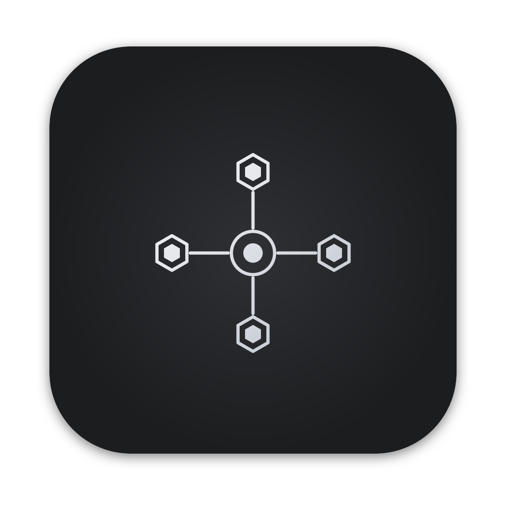

<h1 align="center">
   Cohort
</h1>

<p align="center">
  
</p>

<p align="center">
  <strong>Build, run, and orchestrate automations across repos.</strong><br/>
  Cohort started as a fork of <a href="https://github.com/stablyai/orca">Orca</a> and has evolved into a dedicated automation runner and builder.<br/>
  Available for <strong>macOS, Windows, and Linux</strong>.
</p>

---

## What is Cohort?

Cohort is an Electron desktop app for building and running multi-step automation chains across git worktrees. It began as a fork of Orca — the open-source AI orchestrator — and has since been refocused around automation workflows: defining step chains, running them in parallel, connecting to Linear and GitHub, and managing the full lifecycle of agent-driven development tasks.

### Key capabilities

- **Automation chains** — Define multi-step workflows with a visual editor. Steps run sequentially or in parallel, with template variables that flow outputs between steps.
- **Parallel execution** — Run independent steps side-by-side within a chain. The next step waits for all parallel siblings to complete before advancing.
- **Worktree-native** — Every automation run gets its own git worktree. No stashing, no branch juggling.
- **Multi-agent terminals** — Run Claude Code, Codex, or any CLI agent in tabs and panes. See which ones are active at a glance.
- **GitHub & Linear integration** — PRs, issues, and checks linked to each worktree. Auto-trigger chains from Linear issue events.
- **Built-in source control** — Review diffs, make edits, commit, and create PRs without leaving Cohort.
- **SSH support** — Connect to remote machines and run agents on them directly.

---

## Install

### From source

```bash
git clone <repo-url>
cd cohort
pnpm install
pnpm dev
```

### Building for production

```bash
pnpm build
pnpm dist
```

---

## Developing

See [CONTRIBUTING.md](.github/CONTRIBUTING.md) for setup instructions and contribution guidelines.
